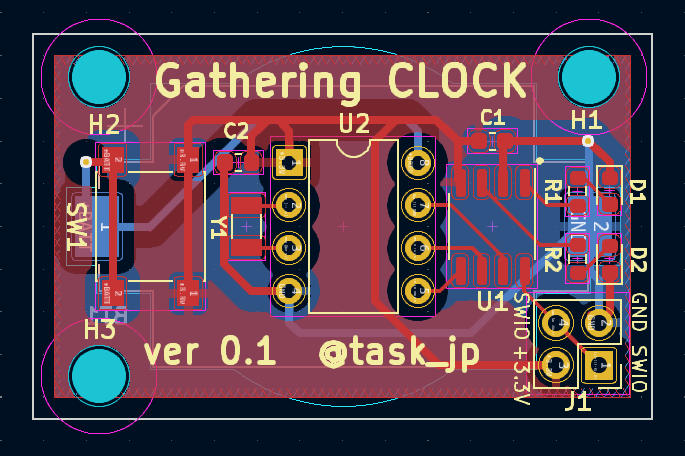

# Gathering CLOCK

Simple two LEDs clock that tells first 5mins in hours.

## Features
* pushing a button in 10 secs resets the clock

|Min|Green|Red|
|---|-----|---|
|0-5|On||
|5-10|Blink||
|10-55||On|
|55-60||Blink|

## Schematic and Layout

## Bill Of Materials
|Ref|Name|Qty|Description|Link|
|---|----|---|-----------|----|
|U1|CH32V003J4M6|1|Micro Controller|[https://akizukidenshi.com/catalog/g/g118062/](https://akizukidenshi.com/catalog/g/g118062/)|
|U2|DS1302+|1|RTC|[https://akizukidenshi.com/catalog/g/g113634/](https://akizukidenshi.com/catalog/g/g113634/)|
|BT1|Battery holder|1|CR2032|[https://akizukidenshi.com/catalog/g/g112908/](https://akizukidenshi.com/catalog/g/g112908/)|
|D1|LED|1|Green|[https://akizukidenshi.com/catalog/g/g106417/](https://akizukidenshi.com/catalog/g/g106417/)|
|D2|LED|1|Red|[https://akizukidenshi.com/catalog/g/g103978/](https://akizukidenshi.com/catalog/g/g103978/)|
|C1,C2|Capacitor|2|0.1uF|[https://akizukidenshi.com/catalog/g/g113374/](https://akizukidenshi.com/catalog/g/g113374/)|
|Y1|Crystal|1|32.768kHz|[https://akizukidenshi.com/catalog/g/g107195/](https://akizukidenshi.com/catalog/g/g107195/)|
|R1|Resistor 0|1|LED limit||
|R2|Resistor 200|1|LED limit|[https://akizukidenshi.com/catalog/g/g106201/](https://akizukidenshi.com/catalog/g/g106201/)|
|SW1|Push Switch|1||[https://akizukidenshi.com/catalog/g/g115969/](https://akizukidenshi.com/catalog/g/g115969/)|

## License
* MIT

## Author
* stasuku@gmail.com
